# Previsão de inadimplência de crédito

Modelo de machine learning e sistema web que estimam a **probabilidade de um pedido de empréstimo não ser pago**. A ferramenta apoia a equipe de crédito de uma fintech: ela recomenda aprovar ou enviar para recusa/análise manual, e a decisão final continua sendo humana.

| | |
|---|---|
| **Modelo final** | Regressão logística (C = 0,03) + feature *comprometimento de renda* |
| **ROC AUC** | 0,794 ± 0,021 (validação cruzada, treino) · **0,808 (teste)** |
| **Limiar de decisão** | **0,21**, escolhido pelo menor custo sem usar o teste |
| **Custo no teste** | **R$ 879 mil**, contra R$ 1,59 mi com limiar 0,5 e R$ 2,05 mi aprovando todos (−57%) |

---

## 1. O problema

Uma fintech recebe pedidos de empréstimo e precisa decidir quais aprovar. Os dois erros possíveis têm custos muito diferentes:

| Erro | O que acontece | Custo |
|---|---|---|
| **Falso negativo**: aprovar quem não vai pagar | perda do capital emprestado e custos de cobrança | **R$ 8.000** |
| **Falso positivo**: recusar quem pagaria | lucro que deixa de entrar e cliente perdido para a concorrência | **R$ 1.500** |

Cada falso negativo custa o mesmo que ~5,3 falsos positivos. O objetivo, portanto, **não é maximizar a acurácia**, e sim **minimizar o custo total** das decisões.

### Dados

`data/credito.csv`, gerado por `gerar_dados.py`: 6.000 contratos, **21,3% inadimplentes** (1.280).

| Coluna | Descrição | Uso |
|---|---|---|
| `id_contrato` | identificador | **descartada** |
| `idade`, `renda_mensal`, `tempo_emprego_anos` | dados do cliente (renda e tempo de emprego têm ausentes) | features |
| `score_credito` | pontuação de 300 a 1000 | feature |
| `dividas_ativas` | dívidas em aberto | feature |
| `possui_imovel` | `sim` / `nao` | feature |
| `finalidade` | `pessoal`, `veiculo`, `reforma`, `educacao`, `negocio` | feature |
| `valor_emprestimo`, `prazo_meses` | valor em R$ e prazo (12 a 60 meses) | features |
| `inadimplente` | **alvo**: 1 = não pagou, 0 = pagou | alvo |

---

## 2. Como executar

```bash
python -m venv .venv
.venv\Scripts\activate            # Linux/Mac: source .venv/bin/activate
pip install -r requirements.txt

python gerar_dados.py             # cria data/credito.csv
python treinar.py                 # treina, escolhe o limiar e salva modelos/credito.joblib
python app.py                     # sistema em http://localhost:5000
jupyter lab notebooks/analise_credito.ipynb   # análise completa (partes 1 a 4 e 6)
```

Saída de `python treinar.py`:

```
=== credito: Risco de crédito ===
limiar de menor custo (validação cruzada no treino): 0.21
teste | ROC AUC 0.8075 | precisão 0.424 | recall 0.766 | F1 0.546 | acurácia 0.728
teste | custo com limiar 0.21: R$ 879,000 (limiar 0,5: R$ 1,588,500)
modelo salvo em ...\modelos\credito.joblib
```

---

## 3. Arquitetura

```
credito-inadimplencia/
├── gerar_dados.py            # gera a base sintética (seed fixa → reprodutível)
├── config.py                 # dicionário PROBLEMAS: features, limites, opções, custos, algoritmo
├── modelagem.py              # blocos compartilhados: pipeline, algoritmos, feature derivada, custo, limiar
├── treinar.py                # treina cada problema do config e salva modelo + limiar + métricas
├── app.py                    # API Flask + página com uma aba por problema
├── templates/index.html      # interface gerada a partir do config (formulário, validação, resultado)
├── notebooks/analise_credito.ipynb   # EDA, comparação, avaliação, limiar, bônus, ética
├── data/credito.csv
├── modelos/credito.joblib    # pipeline treinado + limiar
├── modelos/credito.json      # métricas do treino (CV) e do teste
├── figuras/                  # gráficos gerados pelo notebook
└── capturas/                 # capturas de tela do sistema
```

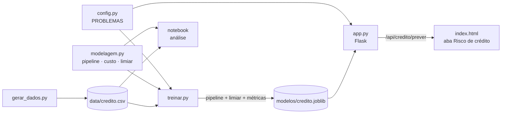

**Decisões de desenho**

- **`config.py` é a fonte única de verdade.** O formulário (campos, limites `min`/`max`, passos, opções dos `select`, campos opcionais), a validação do backend, as colunas do modelo e os custos vêm todos do dicionário `PROBLEMAS["credito"]`. Um novo problema é só uma nova chave, que vira uma nova aba sem mexer em `app.py` nem em `index.html`.
- **`modelagem.py` é compartilhado** pelo notebook e pelo `treinar.py`. Assim, o modelo que o sistema serve é exatamente o que foi avaliado: o `treinar.py` reproduz o limiar (0,21) e as métricas do notebook.
- **O artefato salvo é o `Pipeline` inteiro** (feature derivada → imputação → padronização → one-hot → modelo) mais o limiar. O sistema envia os dados brutos do formulário, e o pré-processamento é idêntico ao do treino.
- **O limiar não é fixo no código.** `treinar.py` recalcula o limiar de menor custo a cada treino, com `cross_val_predict` no treino, a partir dos custos do `config.py`.

### API

`POST /api/credito/prever` com o corpo:

```json
{"idade": 24, "renda_mensal": 2200, "tempo_emprego_anos": 0.5, "score_credito": 420, "dividas_ativas": 4,
 "possui_imovel": "nao", "finalidade": "negocio", "valor_emprestimo": 30000, "prazo_meses": 24}
```

Resposta:

```json
{"probabilidade": 0.959, "limiar": 0.21, "classe": 1, "rotulo": "Risco alto",
 "acao": "Recusar ou enviar para análise manual",
 "perda_esperada_aprovar": 7676.0, "perda_esperada_recusar": 60.8}
```

- Entradas fora dos limites do config, opções inválidas ou campos obrigatórios vazios retornam **400** com a lista de erros.
- `renda_mensal` e `tempo_emprego_anos` são **opcionais**: se vierem vazios, o pipeline imputa a mediana do treino.
- `GET /api/credito/info` devolve as métricas do modelo carregado.

---

## 4. Solução

### Parte 1: análise exploratória

| | |
|---|---|
| 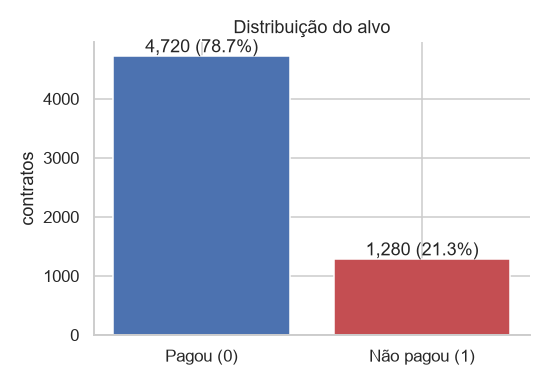 | 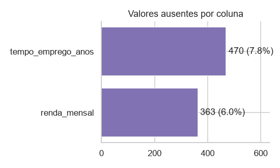 |

- **Proporção de inadimplentes: 21,3%** (1.280 de 6.000). A base é desbalanceada: aprovar todo mundo já dá 78,7% de acurácia. Por isso usamos ROC AUC, precisão, recall e custo, e toda separação é estratificada.
- **Ausentes:** `renda_mensal` tem **363 (6,1%)** e `tempo_emprego_anos` tem **470 (7,8%)**. As demais colunas estão completas. A inadimplência é quase igual com e sem o dado (21,3% × 22,0% e 21,4% × 20,4%), então a ausência não é informativa. Os ausentes são tratados com **mediana dentro do pipeline**, e as linhas não são descartadas.

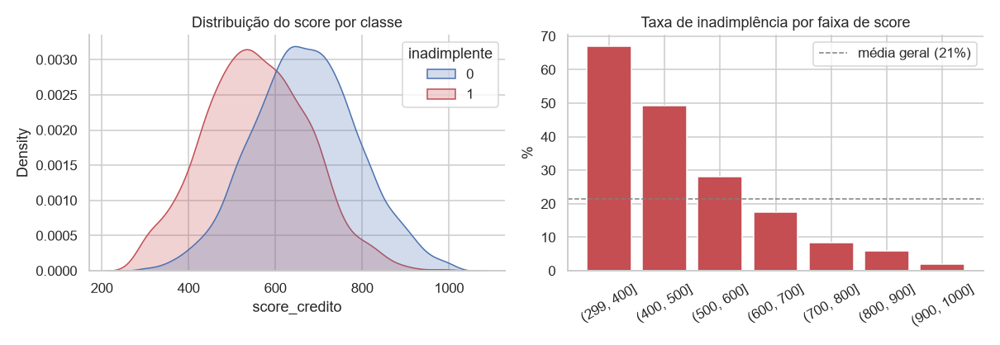

- **Score** é o sinal mais forte (correlação −0,35), com relação monotônica. A inadimplência é de **67%** abaixo de 400 pontos, **28%** entre 500 e 600 e **2%** acima de 900.

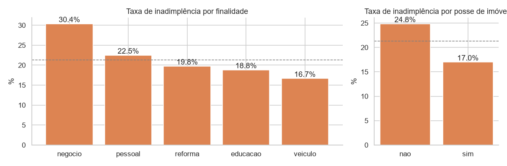

- **Finalidade:** *negócio* é a mais arriscada (30,4%), seguida de *pessoal* (22,5%), *reforma* (19,8%), *educação* (18,8%) e *veículo* (16,7%). O veículo serve de garantia, e a renda de um negócio é incerta.
- **Imóvel:** quem não tem imóvel inadimple **24,8%**, contra **17,0%** de quem tem.

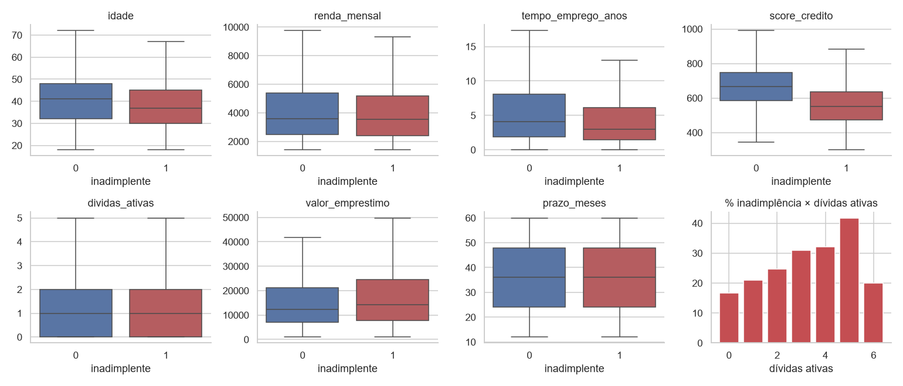

- **Dívidas ativas** aumentam o risco (de 17% sem dívidas para ~40% com 5). A barra de 6 dívidas tem poucos casos. **Tempo de emprego** e **idade** reduzem o risco. Valor maior aumenta um pouco o risco. Prazo e renda isolados pouco discriminam.
- **Coluna descartada: `id_contrato`.** É um identificador sequencial, único por linha, sem relação causal com o pagamento (correlação −0,03, ruído). No modelo, ele só permitiria decorar linhas, e em produção todo pedido tem um id novo. **Nenhuma outra coluna foi descartada:** todas existem *no momento do pedido*, e não há nenhuma variável posterior à concessão (atraso, parcelas pagas) que vazasse o alvo.

### Parte 2: modelagem sem vazamento

- **Treino/teste 80/20 estratificado** (`random_state=42`): 4.800 contratos no treino e 1.200 no teste, ambos com 21,3% de inadimplentes.
- **Pipeline:** `FunctionTransformer(comprometimento)` → `ColumnTransformer[ SimpleImputer(mediana) + StandardScaler | OneHotEncoder(handle_unknown="ignore") ]` → modelo.
- **Por que não vaza:** imputação, escala e codificação são *aprendidas dentro do `fit`*. Na validação cruzada, a mediana e a média de cada fold vêm só dos dados de treino daquele fold. O teste não participa de nenhuma escolha (algoritmo, feature, hiperparâmetro nem limiar).

**Comparação por validação cruzada estratificada de 5 folds (ROC AUC, só o treino):**

| Algoritmo | Média | Desvio | Mín | Máx |
|---|---|---|---|---|
| **Regressão logística** | **0,7905** | 0,0213 | 0,758 | 0,815 |
| Random Forest (300 árvores, `min_samples_leaf=10`) | 0,7783 | 0,0230 | 0,741 | 0,804 |
| HistGradientBoosting | 0,7684 | 0,0232 | 0,734 | 0,799 |

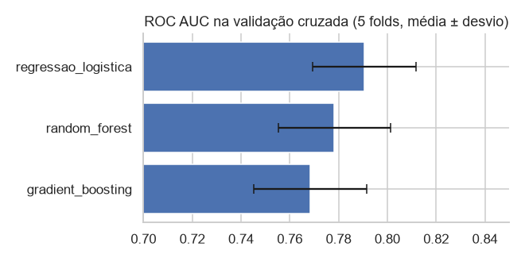

A **regressão logística venceu**. As relações são essencialmente monotônicas, e os modelos de árvore não encontram interações fortes que compensem sua variância maior em 4.800 linhas. Além disso, a logística é **interpretável**, o que importa para explicar uma recusa (LGPD, art. 20). Um ROC AUC de ~0,79 é plausível em crédito, bem longe do alerta de vazamento (> 0,95).

#### Desafios extras

**1. Feature *comprometimento de renda*** = parcela estimada (Tabela Price, 2% a.m.) ÷ renda mensal, calculada dentro do pipeline:

| Algoritmo | Sem feature | Com feature | Efeito |
|---|---|---|---|
| Regressão logística | 0,7905 | **0,7937** | +0,0031 |
| Random Forest | 0,7783 | 0,7800 | +0,0017 |
| HistGradientBoosting | 0,7684 | 0,7667 | −0,0017 |

O ganho é pequeno (menor que o desvio entre folds), porque o modelo já tinha renda, valor e prazo. Mesmo assim ele é consistente nos dois melhores modelos, e a feature resume a capacidade de pagamento. Por isso **ela entra no modelo final**.

**2. `GridSearchCV`**
- Logística, `C ∈ {0,01 … 10}`: melhor **C = 0,03**, com AUC 0,7944. Toda a grade ficou entre 0,7937 e 0,7944, então o modelo é pouco sensível à regularização.
- Random Forest, `min_samples_leaf × max_features`: melhor AUC 0,7811. Continua **abaixo** da logística.

**3. `class_weight="balanced"`** (logística, limiar 0,5, probabilidades de validação cruzada):

| `class_weight` | Precisão | Recall | F1 | ROC AUC | Prob. média prevista |
|---|---|---|---|---|---|
| None | 0,651 | 0,265 | 0,376 | 0,7942 | 0,213 |
| balanced | 0,410 | 0,720 | 0,523 | 0,7941 | 0,427 |

O balanceamento **troca precisão por recall, mas não muda a ROC AUC**: a ordem dos clientes é a mesma, e ele só empurra as probabilidades para cima. Na prática, equivale a baixar o limiar, com a desvantagem de **descalibrar as probabilidades** (elas deixam de significar "chance real de calote"). Por isso o modelo final usa `class_weight=None` e trata o desbalanceamento na escolha do limiar por custo (parte 4), que é mais transparente.

### Parte 3: avaliação no teste

Modelo final treinado no treino completo e avaliado **uma única vez** nos 1.200 contratos de teste:

| Métrica | Limiar 0,5 | **Limiar 0,21 (recomendado)** |
|---|---|---|
| Acurácia | 0,811 | 0,728 |
| Precisão | 0,647 | 0,424 |
| Recall | 0,250 | **0,766** |
| F1 | 0,361 | **0,546** |
| ROC AUC | 0,808 | 0,808 |
| Custo total | R$ 1.588.500 | **R$ 879.000** |

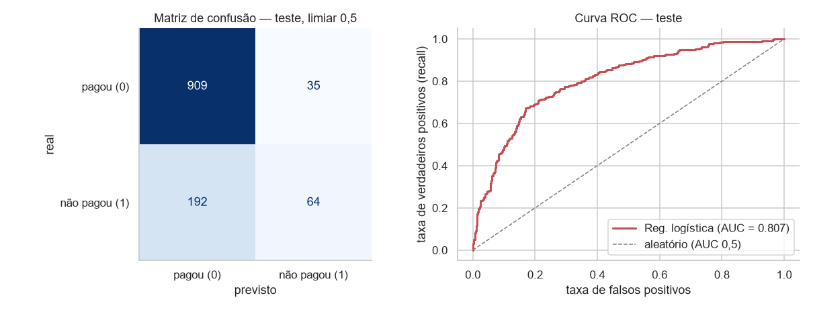

**Interpretação no negócio**
- A ROC AUC no teste (0,808) bate com a da validação cruzada (0,794 ± 0,021). O modelo generaliza, sem sobreajuste nem vazamento. Ao comparar um inadimplente com um bom pagador, o modelo atribui risco maior ao inadimplente em ~81% dos pares.
- Com o limiar 0,5, a acurácia (81%) mal supera "aprovar todos" (79%), e o modelo **deixa passar 75% dos inadimplentes** (192 FN). Acurácia alta aqui é enganosa.
- **Falso positivo** é recusar um bom cliente: perde-se o lucro (R$ 1.500) e o relacionamento. **Falso negativo** é aprovar um inadimplente: perde-se o capital e paga-se a cobrança (R$ 8.000). **O falso negativo é o erro mais caro**, então vale recusar alguns bons clientes a mais para barrar inadimplentes. Por isso o limiar precisa ficar bem abaixo de 0,5.

### Parte 4: limiar de decisão por custo

As probabilidades vêm de `cross_val_predict(pipeline, X_treino, y_treino, cv=5, method="predict_proba")`: cada contrato do treino é pontuado por um modelo que não o viu. **O teste não é usado.**

| Limiar | Precisão | Recall | Aprovados | FN (inad. aprovados) | FP (bons recusados) | **Custo total (treino)** |
|---|---|---|---|---|---|---|
| 0,10 | 0,289 | 0,913 | 32,5% | 89 | 2.304 | R$ 4.168.000 |
| 0,15 | 0,340 | 0,834 | 47,7% | 170 | 1.655 | R$ 3.842.500 |
| 0,20 | 0,393 | 0,755 | 59,0% | 251 | 1.193 | R$ 3.797.500 |
| **0,21** | **0,405** | **0,744** | **60,8%** | **262** | **1.118** | **R$ 3.773.000** |
| 0,25 | 0,455 | 0,676 | 68,3% | 332 | 829 | R$ 3.899.500 |
| 0,30 | 0,497 | 0,586 | 74,9% | 424 | 607 | R$ 4.302.500 |
| 0,40 | 0,599 | 0,439 | 84,4% | 574 | 301 | R$ 5.043.500 |
| 0,50 | 0,672 | 0,274 | 91,3% | 743 | 137 | R$ 6.149.500 |

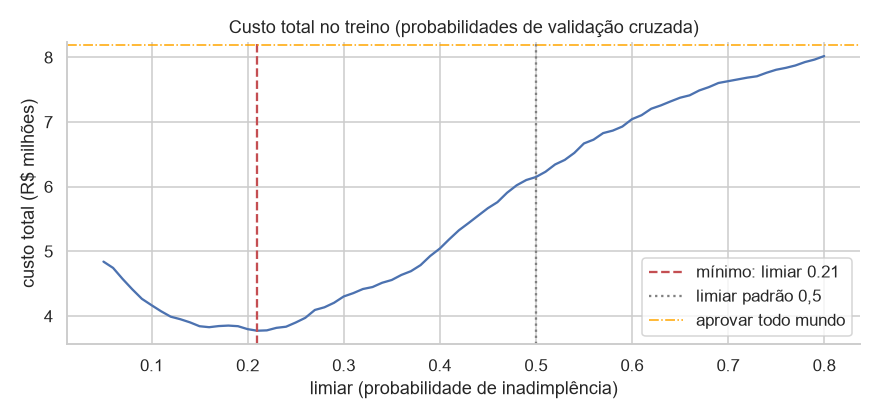

**Recomendação: limiar 0,21.** Pedido com probabilidade ≥ 21% é classificado como **risco alto**.

1. **Menor custo na validação cruzada do treino** (varredura de 0,05 a 0,95 em passos de 0,01).
2. **Coerente com a teoria de decisão.** Recusar compensa quando *p · 8.000 > (1 − p) · 1.500*, ou seja, *p > 0,16*. O ótimo empírico fica próximo, o que indica probabilidades bem calibradas.
3. **Robusto.** A curva é achatada entre 0,15 e 0,22 (variação < 2%). A equipe pode ajustar o volume de aprovações nessa faixa sem grande perda.

**Custo no conjunto de teste:**

| Política | Recall | Aprovados | FN | FP | Custo | Economia |
|---|---|---|---|---|---|---|
| Aprovar todo mundo | 0,00 | 100% | 256 | 0 | R$ 2.048.000 | — |
| Limiar padrão 0,5 | 0,25 | 91,8% | 192 | 35 | R$ 1.588.500 | R$ 459.500 |
| **Limiar 0,21** | **0,77** | **61,5%** | **60** | **266** | **R$ 879.000** | **R$ 1.169.000 (−57%)** |

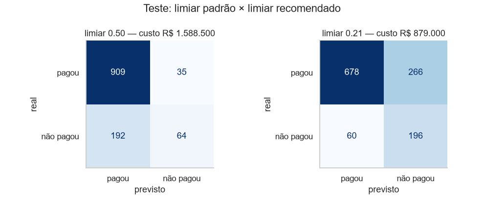

O trade-off é aprovar menos: 61,5% dos pedidos contra 91,8% com 0,5. Se a fintech priorizar volume, a tabela mostra quanto custa cada ponto de aprovação a mais.

#### O que o modelo aprendeu

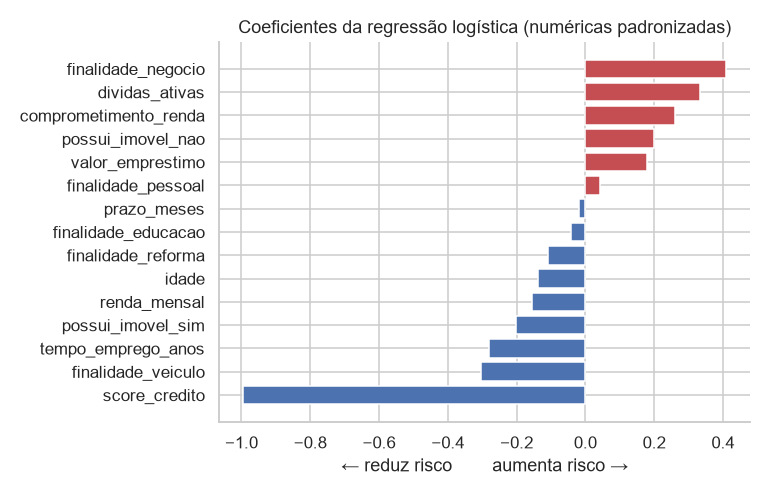

O **score** é o principal redutor de risco. Finalidade *negócio*, **dívidas ativas**, **comprometimento de renda**, não ter imóvel e valor alto aumentam o risco. Tempo de emprego, imóvel e finalidade *veículo* reduzem.

### Parte 5: integração ao sistema

- **`config.py`:** novo problema `credito` no dicionário `PROBLEMAS`, com as 9 features, seus tipos, limites (`min`/`max`/`passo`), valores padrão, unidades, campos opcionais (renda e tempo de emprego) e opções das categóricas. Também guarda o alvo, a coluna descartada, o algoritmo e os hiperparâmetros escolhidos, os custos de FN/FP e os rótulos e ações de cada classe.
- **`app.py`:** carrega o modelo de cada problema, valida as entradas contra os limites do config, devolve probabilidade, classe pelo limiar de custo e perda esperada de cada decisão.
- **`index.html`:** uma aba por problema, com formulário gerado a partir do config. O resultado mostra o veredito, a probabilidade, uma barra com a marca do limiar e a perda esperada.

| Risco alto | Risco baixo |
|---|---|
| 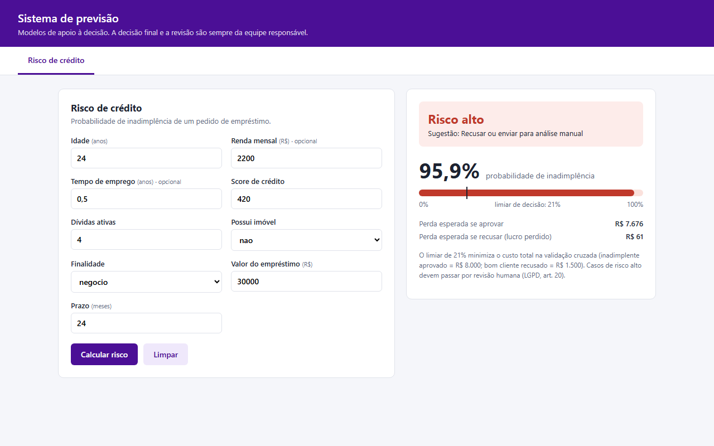 | 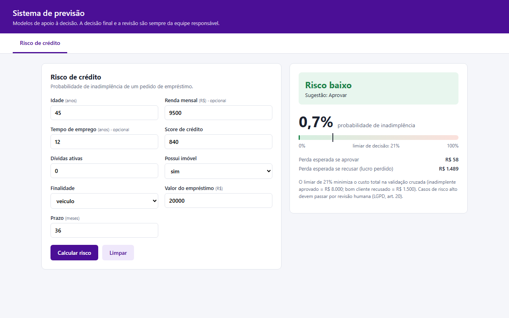 |
| 24 anos, renda R$ 2.200, 6 meses de emprego, score 420, 4 dívidas, sem imóvel, *negócio*, R$ 30.000 em 24 meses → **95,9%** | 45 anos, renda R$ 9.500, 12 anos de emprego, score 840, sem dívidas, com imóvel, *veículo*, R$ 20.000 em 36 meses → **0,7%** |

> Para reproduzir as capturas, abra `http://localhost:5000/?aba=credito&score_credito=420&...&auto=1`. A página aceita os campos pela URL e calcula ao carregar.

### Parte 6: reflexão ética

Modelos de crédito decidem o acesso das pessoas a dinheiro, e por isso podem **reproduzir e ampliar desigualdades históricas**. Se o histórico de treino reflete décadas de exclusão de certos grupos, o modelo aprende que esses grupos são "arriscados" e perpetua o ciclo, mesmo sem ver o atributo sensível, por meio de **variáveis proxy**. Um exemplo é o CEP, que funciona como proxy de raça e classe social. Mesmo que melhorassem a ROC AUC, eu **não usaria** sexo, raça/cor, religião, orientação sexual, estado civil, deficiência, nacionalidade, CEP ou bairro, nem dados de redes sociais ou de navegação. **A `idade`, presente neste modelo, exige cautela**: tem justificativa parcial (ciclo de vida da renda), mas pode penalizar jovens e idosos. O ideal é auditar o desempenho e a taxa de aprovação por faixa etária e considerar retirá-la. A **LGPD** (Lei 13.709/2018) se aplica diretamente. O tratamento tem base legal na proteção do crédito (art. 7º, X) e na execução de contrato, mas deve seguir os princípios de **finalidade, necessidade e não discriminação** (art. 6º): coletar só o necessário e nunca usar dados para discriminação ilícita ou abusiva. Dados sensíveis (art. 11) exigem proteção reforçada. O **art. 20** garante ao titular o direito de pedir **revisão de decisões tomadas unicamente por tratamento automatizado** e de receber informações claras sobre os critérios. Por isso este projeto usa um modelo interpretável, trata o resultado como *recomendação* com revisão humana nos casos de risco alto e deixa isso explícito na interface. Também são necessários segurança dos dados, retenção limitada, relatório de impacto (RIPD) e monitoramento contínuo de vieses e de *drift*.

---

## 5. Limitações e próximos passos

- **Dados sintéticos.** O material original da disciplina (`gerar_dados.py`, `config.py`, `app.py`, `treinar.py`, `index.html`) não estava disponível, então esses arquivos foram **recriados** seguindo o enunciado (colunas, 6.000 contratos, ~21% de inadimplência, ausentes em renda e tempo de emprego). Com o gerador oficial, os números mudam, mas `python gerar_dados.py && python treinar.py` e o notebook refazem tudo.
- **Custos fixos por contrato.** Na prática, a perda de um inadimplente depende do valor emprestado. Um próximo passo é usar custo proporcional ao `valor_emprestimo`.
- O modelo é treinado só no conjunto de treino, para que as métricas reportadas correspondam exatamente ao artefato servido. Em produção, a recomendação é retreinar com toda a base e monitorar a calibração.
- Auditoria de equidade por faixa etária e monitoramento de *drift* em produção.
